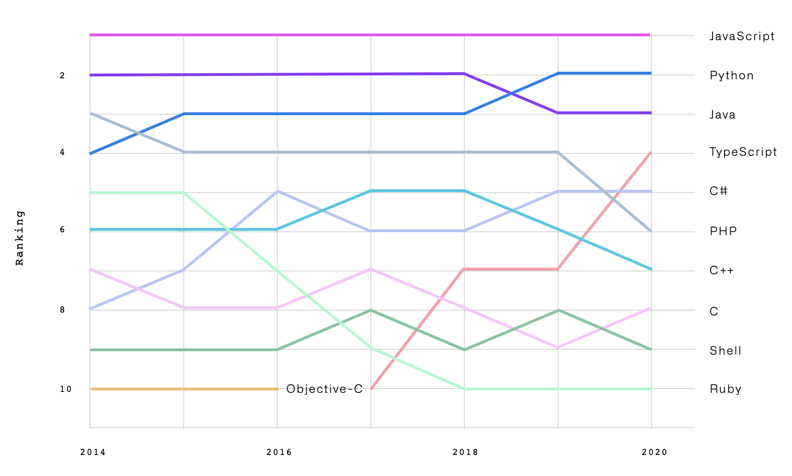
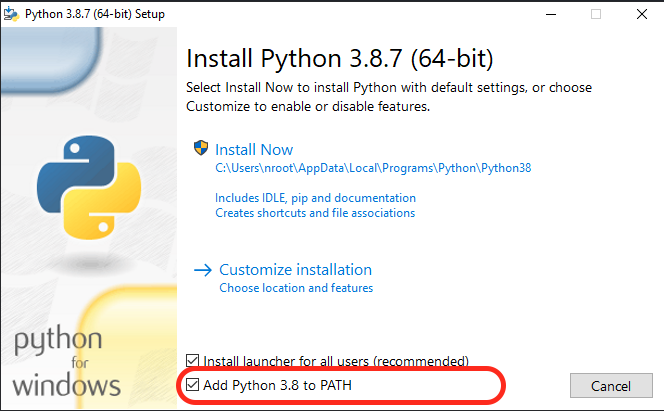
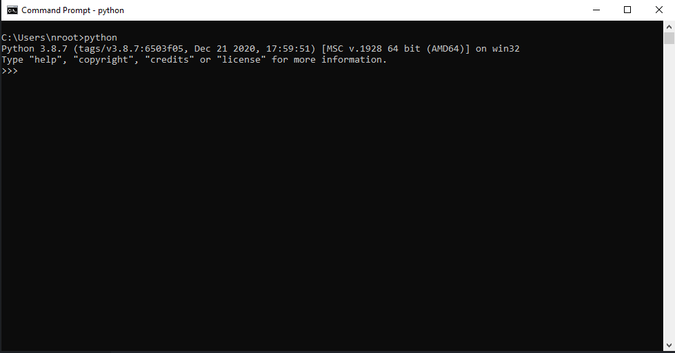

# Python Kurulumu

## Kisaca Python
Python programlarının en büyük özelliklerinden birisi, C ve C++ gibi dillerin aksine, derlenmeye gerek olmadan çalıştırılabilmeleridir. Python’da derleme işlemi ortadan kaldırıldığı için, bu dille oldukça hızlı bir şekilde program geliştirilebilir.

* Derlenmeden yorumlanarak çalışabilir.
* Basit ve temiz söz dizimi bulunur kolay yazılır ve okunur.
* Python 2 vs 3 (Python 2 bazi uygulamalar hala kullaniyor.)
* Uyumlu heryerde calisir.
    - Elektronik - Micropython (https://micropython.org/)
    - Web - Django (https://www.djangoproject.com/)
    - Mobil - Kivy (https://kivy.org/#home)
    - Desktop GUI - PySide2 (https://wiki.qt.io/Qt_for_Python)
    - Devops - Ansible (https://www.ansible.com/)
    - Veri Bilimi - Numpy/Pandas (https://numpy.org/)
    - Görüntü İşleme - OpenCV (https://opencv.org/)
    - Derin Ogrenme - Keras (https://keras.io/)
* Awesome Python (https://github.com/vinta/awesome-python)
* PyPi (https://pypi.org/)
* Turkce Kaynak (https://python-istihza.yazbel.com/)


### C vs Python
```python
# python
print('Hello, World!')
```
```c
// c
#include <stdio.h>
int main()
{
  printf("Hello, World!");
  return 0;
}
```
* **Daha iyi bir ornek**
```python
# python
year = 2021
print('Merhaba İZÜ!')
print(f"{year} Yılındayız.")
```
```c
// c
#include <stdio.h>

int main() {
	int year = 2021;
	printf("Merhaba İZU!\n")
	printf("%d Yilindayiz.\n", year);
	return 0;
}
```


## Python 3.8 Kurulumu

https://www.python.org/downloads/

* Kullanilacak Surum : Python 3.8

**Add Python 3.8 to PATH secilmelidir!**




* Kurulum basarili.



#### Kod yazarken kullanacağımız yardımcılar

Formatter [black] -> https://github.com/psf/black
* Pep kurallarina gore kodu duzenler.

Linter [flake8] -> https://github.com/PyCQA/flake8
* Kod hatalarini soyler.

Import Sort [isort] -> https://github.com/pycqa/isort
* Import edilen kutuphaneleri uygun sekilde siralar.

### Paket Yoneticisi : Pipenv Kurulumu

https://pipenv-fork.readthedocs.io/en/latest/

```shell
pip3 install pipenv
```

## Editor - Ide

* PyCharm - (https://www.jetbrains.com/pycharm/)
* [Visual Studio Code](2-vscode.md)
* Atom - (https://atom.io/)
