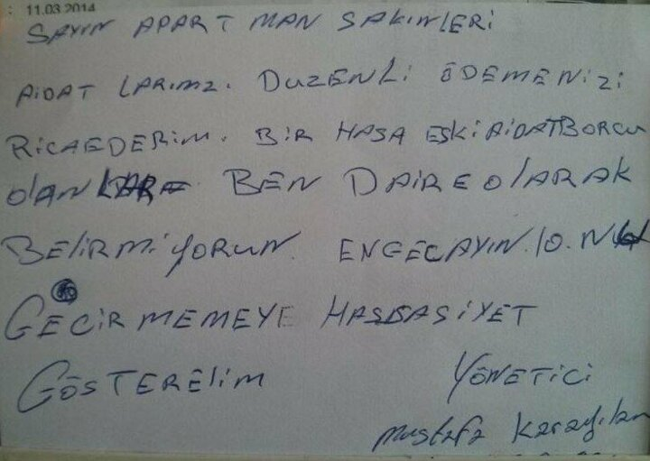
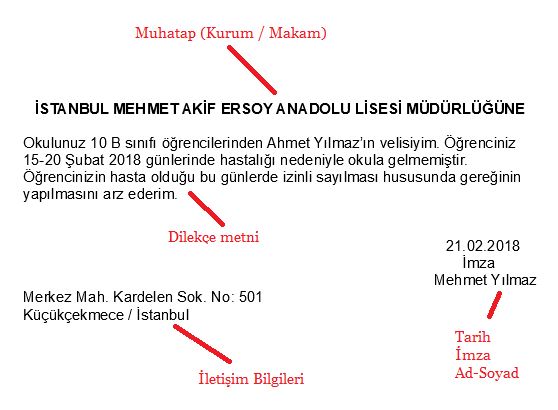

# Python Kurulumu

# github.com/niturk/TemelPythonEgitimi
### Indirme Linkleri
[Python 3.8.7](https://www.python.org/ftp/python/3.8.7/python-3.8.7-amd64.exe)

[Visual Studio Code 1.53.0](https://code.visualstudio.com/sha/download?build=stable&os=win32-user)

**! indir ama kurma okumaya devam et**

</br>


## Kisaca Python
* Python nesneye dayali bir programlama dilidir. (Hersey bir nesnedir.)
* Acik kaynaklidir.
* Python programlarının en büyük özelliklerinden birisi, C ve C++ gibi dillerin aksine, derlenmeye gerek olmadan çalıştırılabilmeleridir.
* Basit ve temiz söz dizimi bulunur kolay yazılır ve okunur.
* Python 2 vs 3 (Python 2 bazi uygulamalar hala kullaniyor.)
* Uyumlu heryerde calisir.
    - Elektronik - Micropython (https://micropython.org/)
    - Web - Django (https://www.djangoproject.com/)
    - Mobil - Kivy (https://kivy.org/#home)
    - Desktop GUI - PySide2 (https://wiki.qt.io/Qt_for_Python)
    - Devops - Ansible (https://www.ansible.com/)
    - Veri Bilimi - Numpy/Pandas (https://numpy.org/)
    - Görüntü İşleme - OpenCV (https://opencv.org/)
    - Derin Ogrenme - Keras (https://keras.io/)
* Awesome Python (https://awesome-python.com/)
* Real Python (https://realpython.com/)
* PyPi (https://pypi.org/)
* Python Tips (https://book.pythontips.com/en/latest/index.html)
* Full Stack Python (https://www.fullstackpython.com/)
* Test Driven Development Course (https://testdriven.io/)
* Turkce Kaynak (https://python-istihza.yazbel.com/)
* Dropbox, Instagram, Amazon, Pinterest, Netflix, Spotify, Facebook, Youtube, Udemy


Github Ranking
### C vs Python
Python Kodu
```python
print('Hello, World!')
```
C Kodu
```c
#include <stdio.h>
int main()
{
  printf("Hello, World!");
  return 0;
}
```
#### **Daha iyi bir ornek**

Python Kodu
```python
# python
year = 2021
print('Merhaba İZÜ!')
print(f"{year} Yılındayız.")
```
```python
python program.py
```
C Kodu
```c
// c
#include <stdio.h>

int main() {
	int year = 2021;
	printf("Merhaba İZU!\n")
	printf("%d Yilindayiz.\n", year);
	return 0;
}
```
```shell
gcc c_programi.c -o programAdi
./programAdi
```

## Python 3.8 Kurulumu

https://www.python.org/downloads/

* Kullanilacak Surum : Python 3.8

**Add Python 3.8 to PATH secilmelidir!**


* Kurulum basarili.


#### Kod yazarken kullanacağımız yardımcılar

Formatter [black] -> https://github.com/psf/black
* Pep kurallarina gore kodu duzenler.



Linter [flake8] -> https://github.com/PyCQA/flake8
* Kod hatalarini soyler.
* Orn. kullanilmayan bir kutuphane cagirildiginda.

Import Sort [isort] -> https://github.com/pycqa/isort
* Import edilen kutuphaneleri uygun sekilde siralar.


### Paket Yoneticisi : Pipenv Kurulumu

https://pipenv-fork.readthedocs.io/en/latest/

```shell
pip3 install pipenv
```

## Editor - Ide

* PyCharm - (https://www.jetbrains.com/pycharm/)
* [Visual Studio Code](2-vscode.md)
* Atom - (https://atom.io/)
