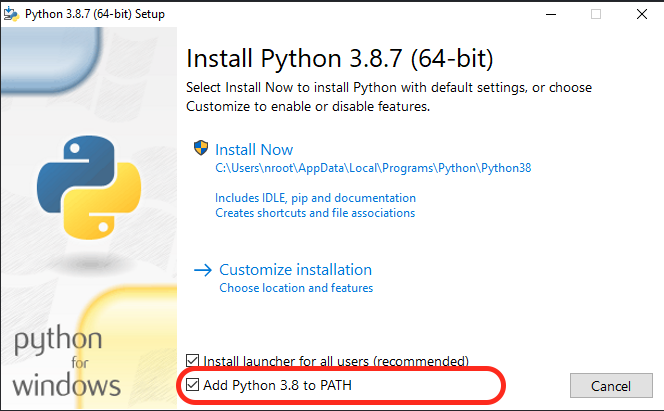
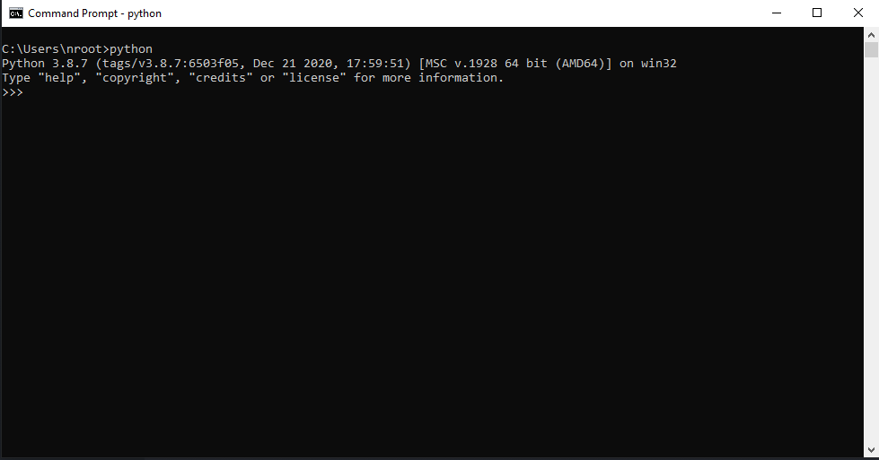

# Python Kurulumu

## Python 3.8 Kurulumu

https://www.python.org/downloads/

* Kullanilacak Surum : Python 3.8

**Add Python 3.8 to PATH secilmelidir!**

* Kurulum basarili.

#### Kod yazarken kullanacağımız yardımcılar

Formatter [black] -> https://github.com/psf/black
* Pep kurallarina gore kodu duzenler.

Linter [flake8] -> https://github.com/PyCQA/flake8
* Kod hatalarini soyler.

Import Sort [isort] -> https://github.com/pycqa/isort
* Import edilen kutuphaneleri uygun sekilde siralar.