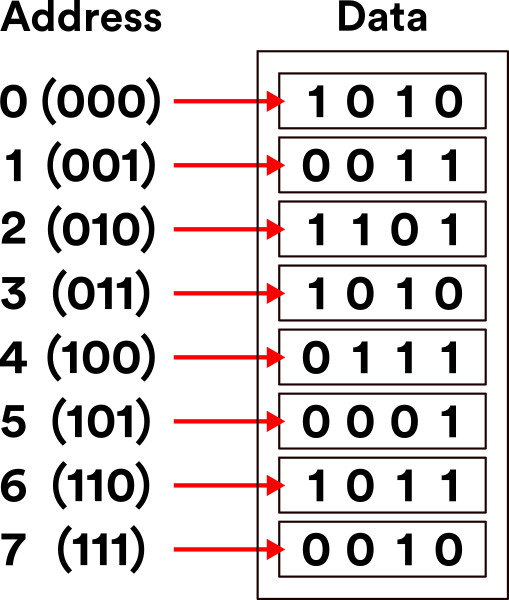
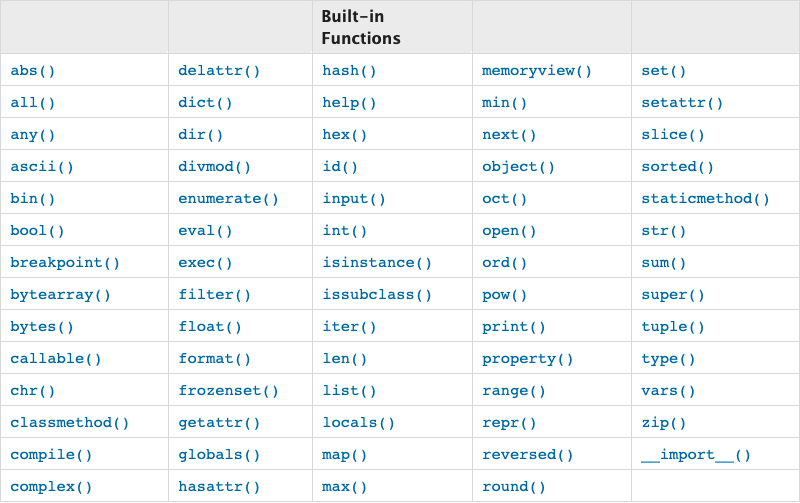

# Python Temeller
[Geri](2-vscode.md)

## Matematik > Fonksiyonlar
```python
f(x) = y
f(x) = 2x + 1

x: 'Merhaba'
f: 'Ekrana merhaba yazdiran fonksiyon.'

print(x): ekrana 'Merhaba' yazdir.

print(3)

print(1 + 2)

print(7 * 6)

print( 2 * 2 + 5 )

print( 2 * (2 + 5) )

```

## Print vs String Veri Tipi Ornekleri
```python
# yorum
print('Merhaba IZU')
print('Python', "egitimi", 'basliyor.')
print('Merhaba' + ' IZU')
print('Merhaba "python" ogreniyoruz.')
```

## Veri Tipleri

| Ornek | Veri Tipi
|-------|----------
|`x = "Merhaba IZU"`|String|
|`x = 20` | Integer
|`x = 20.5` | Float
|`x = True , x = False` | Boolean
|`x = ['elma', 'armut']`| List (Mutable)
|`x = ('elma', 'armut')`| Tuple (Immutable)
|`x = {'adi': 'Nikita', ]'soyadi': 'Turkmen'}`| Dict
|`x = {'elma', 'armut'}`| Set (Unique)



### Veri Tipleri Ile İşlemler 
#### Ozel fonksiyonlar


[Standart Fonksiyonlar](https://docs.python.org/3.8/library/functions.html)
* degisken olarak tanimlanamazlar
#### Çağırılmadan çalışmayan fonksiyonlar
https://docs.python.org/3.8/library/

* karekok alma
```python
from math import sqrt

sayi = 100
karekoku = sqrt(sayi)

print(karekoku)
```
* tarih yazdirma
```python
from datetime import date
bugun = date.today()
print(bugun)
```

#### String Islemleri
```python
# f(x) - g(f(x))
# s = str('Nikita')
ad = 'Nikita'
soyad = 'TURKMEN'
adsoyad = 'Nikita TURKMEN'

print(type(adsoyad)) # type

print(adsoyad)

print(len(adsoyad)) # length

print(adsoyad[0]) # slicing
print(adsoyad[2:])
print(adsoyad[:3])
print(adsoyad[2:4])
print(adsoyad[::2])
print(f'Ad: {ad}, Soyad: {soyad}') # formatting
print('Ad: {0}, Soyad: {1}'.format(ad,soyad)) # formatting
```
Daha fazlasi icin -> https://pyformat.info/

#### Komut Tabanli Uygulamalar icin Kullanicidan Veri Almak
```python
ad = input('Adiniz nedir ?')
print(f'Merhaba {ad}')
```

#### Integer
```python
# f(x) - g(f(x))
# integer islemleri
x = 5
print(type(x))

y = 10

z = x + y
z = z + 1

print(z)

a = 9
b = 3

print(a + b) # toplama
print(a - b) # cikarma
print(a * b) # carpma
print(a / b) # bolme
print(a % b) # mod alma a nin b den bolumunden kalan

print(((a + b) / 2 - 4) * 12)


yas = 28
print(yas)
print(type(yas))

yas = '28'
print(yas)
print(type(yas))

ad = 'Nikita'
yas = 28
print('Ad ' + ad + ' Yas ' + yas)

print(ad * 5)


```

#### Float
```python
x = 20.5
print(x)
```
#### Boolean
```python
x = True
print(type(x))
print(1 > 2)
print(2 == 2)
print(x)
```

#### List
```python
# mutable
l = ['elma', 'armut']
print(x[0])
l2 = ['domates', 'salatalik']
l3 = l1 + l2
print(l3)
l2[0] = 'patates'
l2.append('sogan') # eleman ekleme.
l2.pop() # son elemani cikartir.
l2.pop(0)
num_list = [3,10,1,8,9]
num_list.sort()
num_list.reverse()
```

#### Tuple
```python
# immutable
t = ('elma','armut')
print(type(t))
print(len(t))
print(x[0])
```

#### Dictionaries
```python
d = {
    'key1': 'value1',
    'key2': 'value2'
}
print(d['key1'])
d.keys()
d.values()
```

#### Setler
```python
s = set()
s.add('elma')
s.add('armut')
s.add('armut')
print(s)
l = [1,1,1,1,2,2,2,2,3,3,3,3,4,4,4,4,5,5,5,56,6,6,6,6,7,7,7,8,8,8,8]
set(l)
```

[Dosya Islemleri](4-dosyaislemleri.md)

